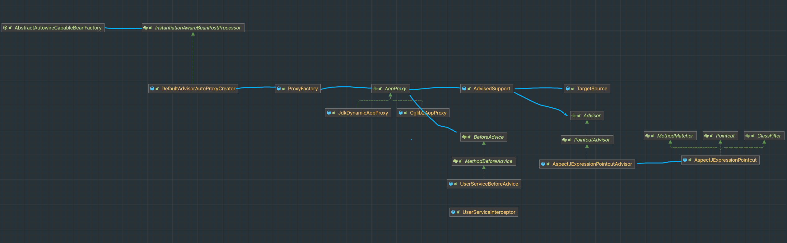

# 实现Spring AOP切面
## 核心原理
1. 定义切点，去匹配对应的类和方法 【Pointcut】
2. 定义织入对象【AdvisedSupport】，包含目标类和切面类【MethodInterceptor】，匹配器【AspectJExpressionPointcut】 
3. 通过动态代理，生成代理类。代理类注入织入对象。 
4. 代理类需要重写执行方法逻辑，在执行方法的时候， 通过织入对象的匹配器去匹配，如果匹配到了，就执行切面类的切面逻辑，如果没有匹配到，就执行原来的方法逻辑

## spring aop的实现对bean方法增强原理
如果需要对spring的bean的方法进行增强，首先得知道要哪些bean需要增强，然后对这些bean进行代理。需要在实例化之前，优先生成代理对象。
1. 定义InstantiationAwareBeanPostProcessor。在createBean实例化之前，生成代理对象。
2. 在InstantiationAwareBeanPostProcessor的实现类DefaultAdvisorAutoProxyCreator中处理方法过滤代理对象的生成逻辑。
   1. 获取所有的AspectJExpressionPointcutAdvisor切面类，通过切面类的匹配器匹配到所有的bean的方法。
   2. 如果匹配上了，就生成代理对象，否则就不生成代理对象。
3. 代理对象生成之后，就不用实例化bean了，直接返回代理对象。
### 大致链路
