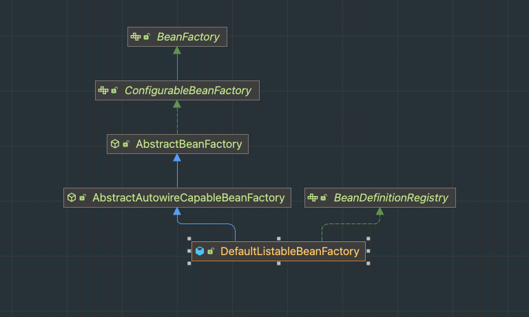

# 实现Spring IOC容器
通过对Spring IOC容器的实现，可以更好的理解Spring IOC容器的实现原理，以及Spring IOC容器的扩展点。
## 目录结构

## IOC容器核心步骤
1. 初始化容器
2. 注册bean定义
3. 获取bean

## IOC容器核心组件

### BeanFactory
bean工厂，定义了IOC容器的基本功能，主要是获取bean，创建bean等。是整个ioc容器的根基，核心定义
### BeanDefinitionRegistry
bean定义注册器，主要定义了BeanDefinition的相关功能。
## IOC相关类的继承关系
目前暂时只是简化版

spring的相关继承关系

## 测试
在test包下的TestMain中，可以看到测试的代码，可以通过debug的方式，一步一步的看到spring的初始化过程。