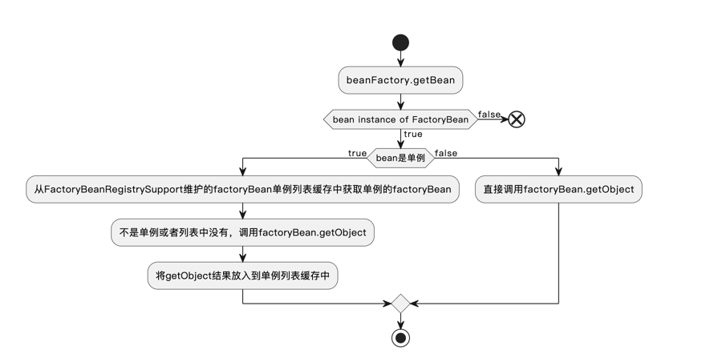

## 职责
spring-beans模块主要负责bean的定义的加载与管理，bean的创建与管理, bean定义如何转换成bean，工厂bean的实现。
## spring-beans模块核心功能分析
1. Bean的定义的加载与管理
2. Bean定义如何转换成bean
3. Bean的创建与管理
4. FactoryBean实现原理

### Bean的定义的加载与管理
BeanDefinition可以通过资源加载器从一系列的资源中加载，这些资源包括url流，文件系统，类路径文件等，然后通过BeanDefinition注册器注册，最终由注册器进行管理，
而DefaultListableBeanFactory就是一个BeanDefinition注册器的实现。详细的类图关系如下图所示。

### Bean的创建与管理
拿到所有的BeanDefinition之后，就可以进行Bean的加载了。bean加载的核心在于BeanFactory的getBean方法。这个方法包揽的bean的获取和创建工作，
其中包括我们熟知的Bean的生命周期，三级缓存，FactoryBean的实现等。这里的类的继承关系比较复杂，涉及到很多的类，详细的类图关系和职责说明如下图。 

    spring的高扩展性设计在这里体现的淋漓尽致，每一个接口都体现了它的职责。 
    在一些不是很复杂的业务上，这么多的类的继承关系可能写起来比较繁琐，明明一个接口可以定义完，非要整这么多接口。
    但在spring这种复杂项目中，这种单一职责的原则才是它非常易于扩展的基石。

#### 三级缓存
在bean的加载过程中，可能存在循环依赖问题。spring通过三级缓存来解决循环依赖问题。
主要是通过DefaultSingletonBeanRegistry中的三个list来保存：
1. singletonObjects 一级缓存， 保存的是成品对象
2. earlySingletonObjects 二级缓存， 保存的是半成品对象，主要是解决循环依赖的问题
3. singletonFactories 三级缓存， 保存的是单例对象的工厂，主要用来解决动态代理增强对象的循环依赖问题，这种对象往往new完之后，往往引用还会发生变更

#### FactoryBean
工厂对象，主要用于创建bean，可以通过实现FactoryBean接口，来自定义bean的创建过程。
很多动态代理生成对象的bean就是通过这种方式注入到spring容器中的，比如我们熟知的mybatis的SqlSessionFactory.

factoryBean的实现原理分为两个核心:
1. factoryBean是怎么加载到spring容器中的，这里和普通的bean一样也是通过BeanDefinition动态生成bean的实例的。
2. factoryBean的生产的对象是怎么注入到spring容器中的

#### BeanFactoryPostProcessor 和 BeanPostProcessor
BeanFactoryPostProcessor很好理解，就是BeanFactory加载完成之后调用的处理方法。
在spring上下文的refresh方法中，第三步就是执行BeanFactoryPostProcessor的方法。
这个过程在加载完所有的BeanDefinition就基本上开始执行了。

而BeanPostProcessor就是bean加载完成之后调用的处理方法。这个是在Bean的生命周期中，bean的实例化过程中触发的。

## IOC相关类的继承关系

spring源码中的相关继承关系

## 测试
在test包下的TestMain中，可以看到测试的代码，可以通过debug的方式，一步一步的看到spring的初始化过程。