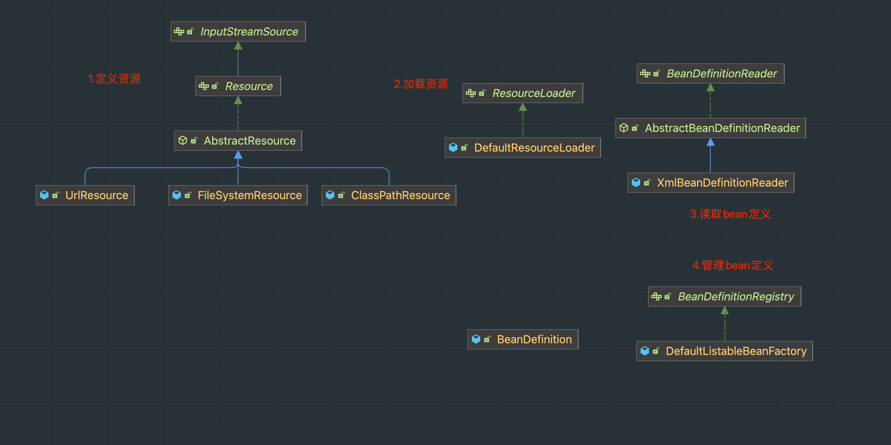

# 实现Spring IOC容器
通过对Spring IOC容器的实现，可以更好的理解Spring IOC容器的实现原理，以及Spring IOC容器的扩展点。

## IOC容器核心步骤
1. 初始化容器 【spring-context模块】
2. 读取xml文件或者注解 【spring-core模块】
2. 注册bean定义 【spring-beans模块】
3. 获取bean 【spring-beans模块】

## spring-beans模块核心功能分析
1. Bean的创建与管理
2. Bean的定义的加载与管理
3. Bean定义如何转换成bean
5. 工厂bean的实现

### Bean的创建与管理
类图关系总览

### Bean的定义的加载与管理
类图关系总览

### FactoryBean
工厂对象，主要用于创建bean，可以通过实现FactoryBean接口，来自定义bean的创建过程。

## IOC相关类的继承关系

spring的相关继承关系

## 测试
在test包下的TestMain中，可以看到测试的代码，可以通过debug的方式，一步一步的看到spring的初始化过程。