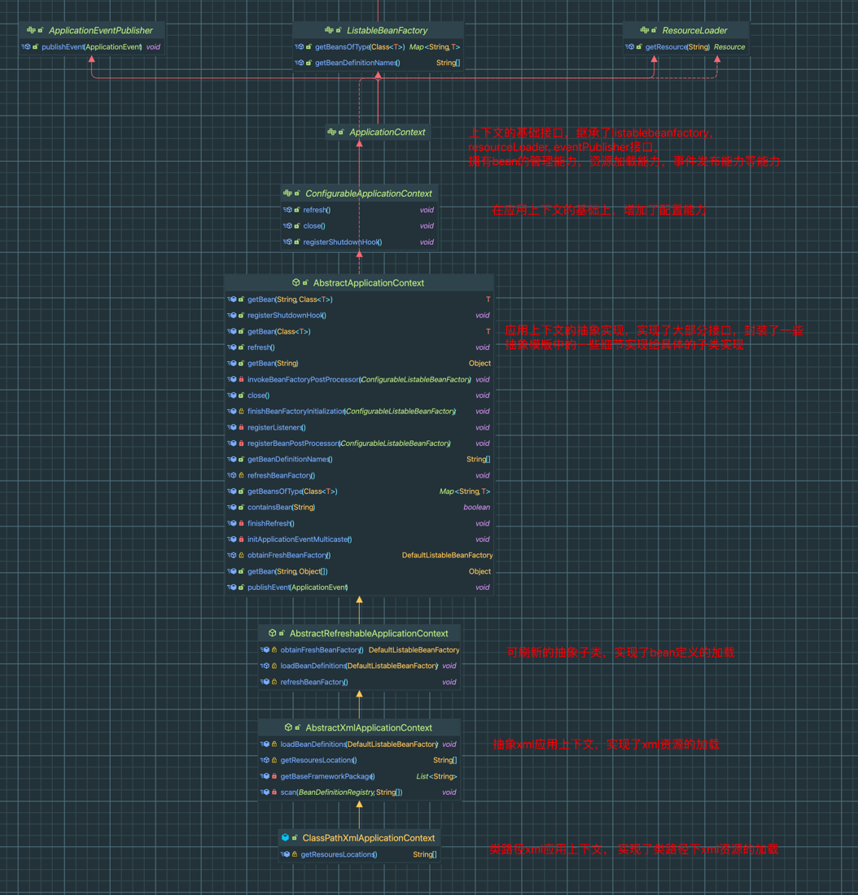
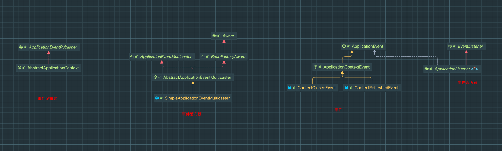
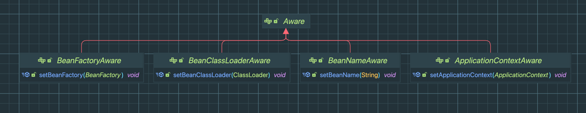
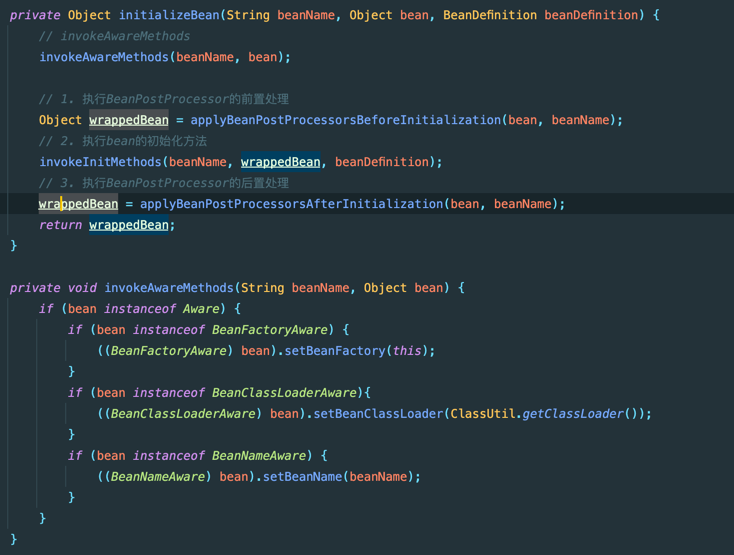

## 职责
spring-context模块主要负责提供应用上下文的支持，包括bean的加载、生命周期管理、事件发布订阅机制、资源加载、国际化等功能。
## spring-context模块核心功能分析
1. 应用上下文和BeanFactory的关系
2. 自动扫描bean，beanFactoryPostProcessors的注册执行等是如何实现的
3. 事件发布订阅机制实现 
4. 感知对象Aware含义与实现

## 核心类及其继承关系

## ApplicationContext和BeanFactory的关系
从类的实现上来看，ApplicationContext也实现了BeanFactory的接口，也拥有了BeanFactory。
但从职责来看，ApplicationContext却是管理着BeanFactory。从[spring-beans](./spring-beans/spring-beans.md)我们可以看出，
spring-beans拥有了Bean的定义的加载与管理，Bean的创建与管理等功能，但是它却缺乏了一个执行者和管理者，不管是Bean定义的加载还是Bean的获取，都需要有人触发这个动作。
而ApplicationContext就充当了这个角色。ApplicationContext中的refresh方法串联了整个流程，BeanFactory的初始化，BeanDefinition的加载，
beanFactoryPostProcessors的注册执行，BeanPostProcessor的注册等等。整个流程看起来就十分优雅，同时在这个流程中还能添加一些新的功能，如事件通知，发布订阅等。用户不再需要关心，如何触发这一系列的动作，只需要按照相应的方式
添加扩展，就非常友好。

详细看看 [AbstractApplicationContext.refresh](src/main/java/org/skitii/context/support/AbstractApplicationContext.java)

## 事件发布订阅实现原理
ApplicationContext管理的beanfactory的执行时机，那如何用户想在中间的一些阶段做一些动作，比如在容器启动完成之后，开启一个异步任务之类的。
spring就是通过事件发布订阅的方式来实现这样的通知机制的。

我们先来看看类的继承关系

#### 事件发布
1. ApplicationContext实现了ApplicationEventPublisher接口，拥有了事件发布能力
2. AbstractApplicationContext内部组合了ApplicationEventMulticaster事件发布器
3. 最终ApplicationEventMulticaster事件发布器的multicastEvent发布消息

#### 事件监听
1. 在AbstractApplicationContext的refresh方法中，事件发布器初始化之后，会添加监听器
2. 实现了ApplicationListener的子类bean会被添加到ApplicationEventMulticaster所管理的监听器列表中
3. 在ApplicationEventMulticaster事件发布器的multicastEvent发布消息中，会先根据类型筛选事件监听者，
4. 然后调用ApplicationListener的onApplicationEvent方法

## 感知对象Aware含义与实现
感知对象Aware：实际上就是在bean的过程中，可以通过实现一些aware接口感知到容器内的一些关键类的进度，如，实现ApplicationContextAware，就可以在bean里面拿到ApplicationContext实例了。

感知对象类型

感知对象实现 ：在初始化bean的时候，先调用aware的方法

